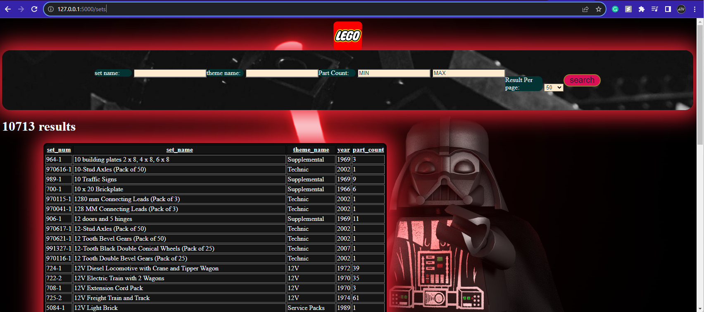

# Lego Website Readme

## Introduction

This repository contains the code for a web application that serves as a Lego sets information search tool. Users can search for Lego sets based on various criteria, and the results are displayed in an HTML table. This README provides an overview of the application and instructions for setting it up and running it.

## Features

### Search Form

The Lego website provides a search form with the following features:

- **Set Name:** A case-insensitive partial search on the set name.
- **Theme Name:** A case-insensitive partial search on the theme name.
- **Part Count:** Two number fields for setting minimum and maximum part count.
- **Results Per Page:** A dropdown list to limit the number of results per page, with values 10, 50, and 100. Default is 50.

Additionally, users can specify the following parameters:

- **Page Number:** Navigate through search results.
- **Sort Column:** Clickable column headers to sort the results.
- **Sort Direction:** Indicates the sorting order (ascending or descending).

### Search Results

Search results are displayed in an HTML table with the following columns:

- **Set Number (set_num)**
- **Set Name**
- **Theme**
- **Year**
- **Part Count**

The table includes column headers that are clickable for sorting, with an arrow indicating the sort direction. The footer of the table provides a dropdown to select the current page number or change to another applicable page.

## Getting Started

To set up and run the Lego website, follow these steps:

1. **Clone the Repository:** Clone this repository to your local machine.

2. **Initialize Database:** Ensure you have PostgreSQL installed and running. Create a `.devcontainer/pg_init` folder and add SQL files for initializing the database. Refer to the PostgreSQL Docker readme for details.

3. **Install Dependencies:** Open the project in VS Code using the Remote Development Extension Pack. It will set up the necessary development environment, including Docker containers. Install any required Python packages with `pip`.

4. **Run the Flask Application:** In the integrated terminal of VS Code, run the Flask application with the following command:

flask --debug run

This will start the server on port 5000, and you can access the website at `http://localhost:5000`.

5. **Access pgAdmin DBMS:** Open a browser and access `http://localhost:5050`. Use the following credentials to log in:

- **Username:** admin@admin.com
- **Password:** root

Set up a new database connection using the following credentials:

- **Host:** db
- **Username:** postgres
- **Password:** postgres

6. **Use the Lego Website:** Open a web browser and navigate to `http://localhost:5000/sets`. You can now search for Lego sets and explore the results.

